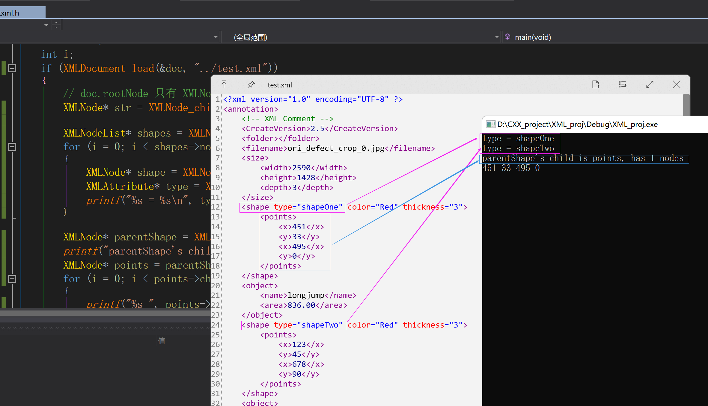

# Tiny-XML
___
**`2023-01-15`**:**基于C语言实现的小型XML解析器**

- **解析代码实现仅600余行**
- **大部分数据结构使用链表实现，`malloc、free、realloc、strdup`函数已在文件开头使用宏定义设置，方便移植于别的平台**
- **项目注释内容丰富，数据结构和常用函数方法已于文件头部给出，并分为了内部接口和外部接口**
- **已使用内存分析工具测试，内存的申请释放已相互匹配，无内存泄露**
- **single header file**

>本来这个项目是要用在STM32平台上的，但后来有了更好的操作方式，遂放弃。

## 结果展示


## 使用方法
- 打开xml文件
```C
XMLDoc doc;
if (XMLDocument_load(&doc, "./test.xml"))
{
    // your code
}
```

- 输出一个xml文件
```C
XMLDocument_write(&doc, "out.xml", 4);  // 输出一个xml文件
```

### 数据结构

| 名称          | 说明        |
|:------------|:----------|
| XMLNode     | 单个节点      |
| XMLNodeList | XMLNode的组 |

### 常用外部函数

|函数名|说明|
|:-----|:-----|
|XMLNodeList *XMLNode_children(XMLNode *parent, const char *tag)|从传入结点的子一级中查找标签名称为tag的所有元素，并封装成 XMLNodeList|
| XMLNode *XMLNode_child(XMLNode *parent, int index)            |返回传入结点的 第index个 子节点指针|
| XMLNode *XMLNodeList_at(XMLNodeList *nodeList, int index)     |返回传入结点列表的 第index个 结点指针|
|XMLAttribute *XMLNode_attr(XMLNode *node, char *key)|在一个元素的属性列表中根据key返回对应的 XMLAttribute *|


